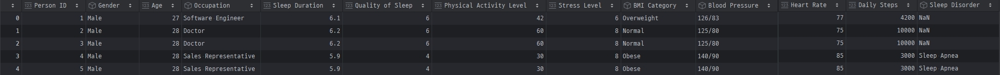
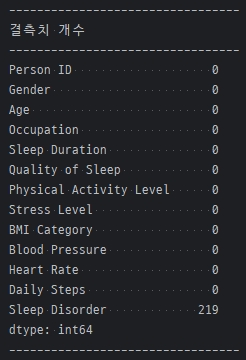

# SKN14-EDA-1Team( JJNJJ )

------------------------------------------------------------------------------
# 🚀 프로젝트 및 개요

## EDA 해체 Show
- 데이터를 씹고, 뜯고, 맛보고, 즐겨보자.
- 그렇게 분석한 데이터로부터 유의미한 결과를 이끌어내보자.

------------------------------------------------------------------------------
# 선택한 데이터셋
- _**Sleep health and Lifestyle Dataset**_
- _**CSV**_ Type
- _**13**_ Features, _**374**_ Records
- 수면의 질을 포함하여, 수면장애에 영향을 미치는 특성을 찾아보고 분석해볼 수 있는 데이터셋

------------------------------------------------------------------------------
# 데이터셋 초기 상태

------------------------------------------------------------------------------
# 📚 수집 데이터 설명

| Column                  | Description                                           |
|:------------------------|:------------------------------------------------------|
| Person ID               | 각 조사대상자의 일련번호                              |
| Gender                  | 성별 (Female, Male)                                   |
| Age                     | 나이                                                  |
| Occupation              | 직종                                                  |
| Sleep Duration          | 하루 수면시간(hours)                                  |
| Quality of Sleep        | 수면의 질에 대한 주관적인 평가( 1 ~ 10 )              |
| Physical Activity Level | 일별 육체활동 시간(minutes)                           |
| Stress Level            | 스트레스 레벨에 대한 주관적인 평가( 1 ~ 10 )          |
| BMI Category            | BMI 범주( Obese, Overweight, Normal weight, Normal )  |
| Blood Pressure          | 수축기/이완기 혈압                                    |
| Heart Rate              | 휴식 동안의 분당 심박수                               |
| Daily Steps             | 일일 걸음수                                           |
| Sleep Disorder          | 수면장애 여부( None, Insomnia, Sleep Apnea )          |

------------------------------------------------------------------------------
# 💭 한줄 회고
<table>
  <tbody>
    <tr><th width="100"><strong>김재아</strong></th><td></td></tr>
    <tr><th width="100"><strong>김재우</strong></th><td></td></tr>
    <tr><th width="100"><strong>박빛나</strong></th><td></td></tr>
    <tr><th width="100"><strong>송지훈</strong></th><td>간단하고 명확해보이는 데이터셋도 깊게 파고들수록 나 자신과 데이터를 의심하게 됐다.</td></tr>
    <tr><th width="100"><strong>조성재</strong></th><td></td></tr>
  </tbody>
</table>