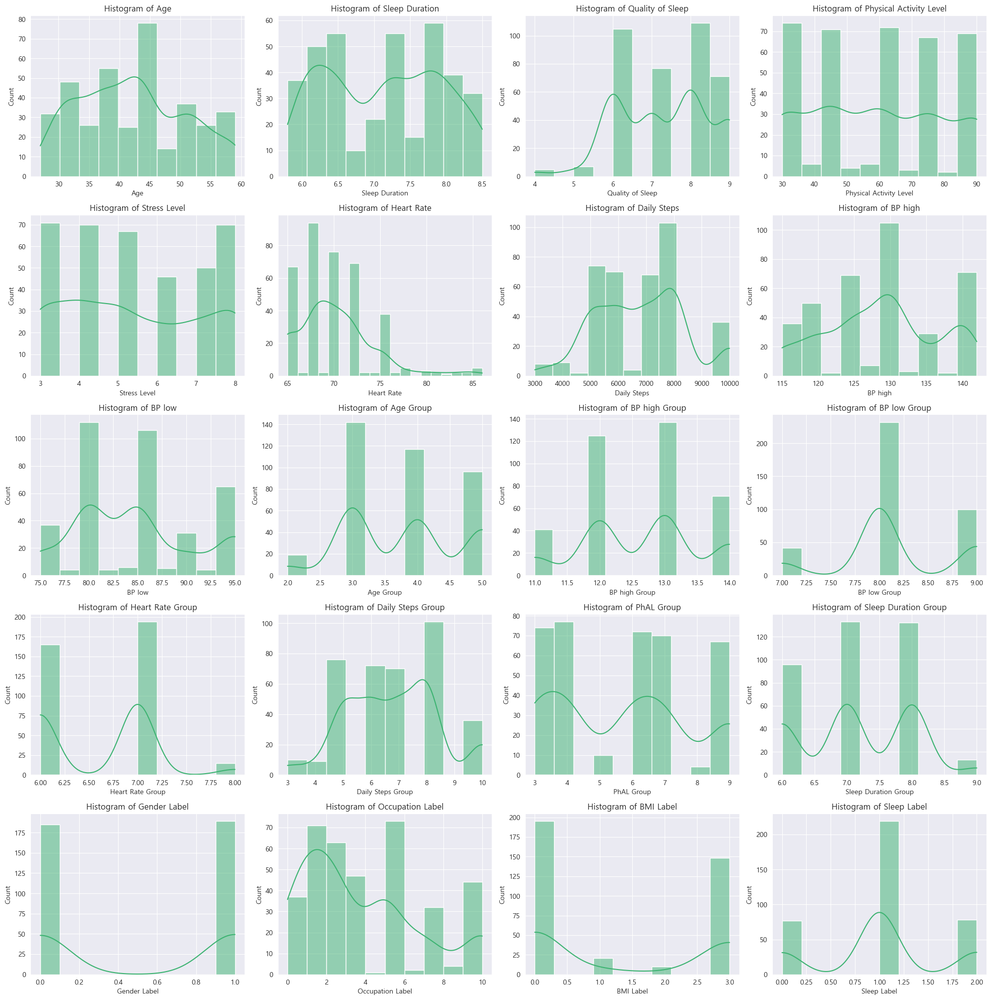
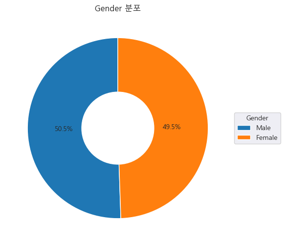
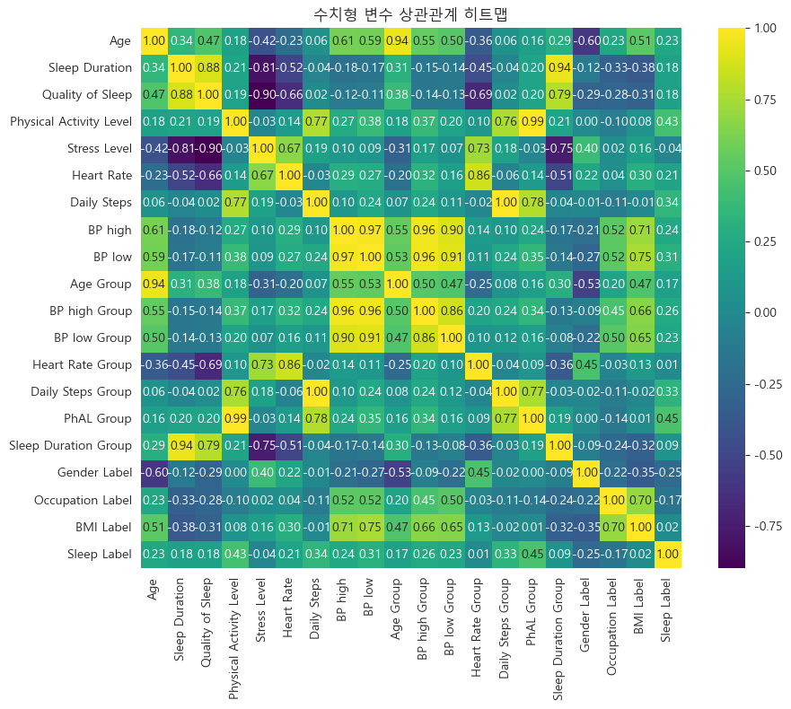
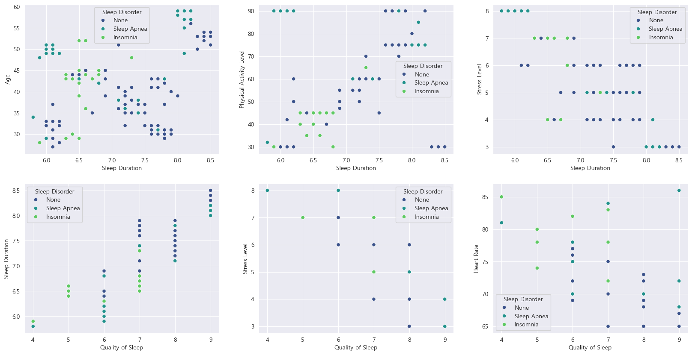
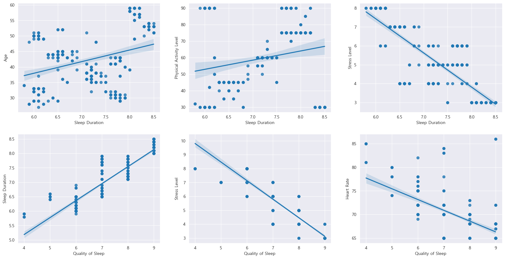
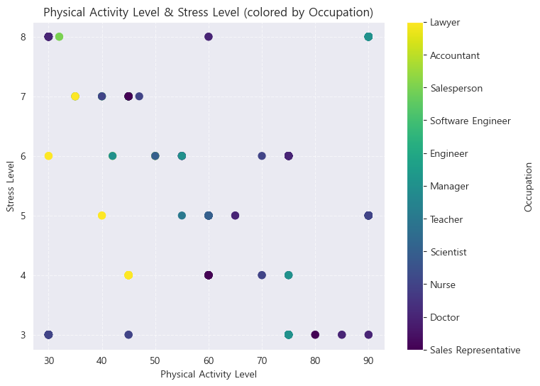

# SKN14-EDA-1Team( JJNJJ )

------------------------------------------------------------------------------
# 🚀 프로젝트 및 개요

## EDA 해체 Show
- 데이터를 씹고, 뜯고, 맛보고, 즐겨보자.
- 그렇게 분석한 데이터로부터 유의미한 결과를 이끌어내보자.

------------------------------------------------------------------------------
# 선택한 데이터셋
- _**Sleep health and Lifestyle Dataset**_
- _**CSV**_ Type
- _**13**_ Features, _**374**_ Records
- 수면의 질을 포함하여, 수면장애에 영향을 미치는 특성을 찾아보고 분석해볼 수 있는 데이터셋

------------------------------------------------------------------------------
# 🔧사용한 Tool

------------------------------------------------------------------------------
# 데이터셋 초기 상태

------------------------------------------------------------------------------
# 📚 수집 데이터 설명

| Column                  | Description                                           |
|:------------------------|:------------------------------------------------------|
| Person ID               | 각 조사대상자의 일련번호                              |
| Gender                  | 성별 (Female, Male)                                   |
| Age                     | 나이                                                  |
| Occupation              | 직종                                                  |
| Sleep Duration          | 하루 수면시간(hours)                                  |
| Quality of Sleep        | 수면의 질에 대한 주관적인 평가( 1 ~ 10 )              |
| Physical Activity Level | 일별 육체활동 시간(minutes)                           |
| Stress Level            | 스트레스 레벨에 대한 주관적인 평가( 1 ~ 10 )          |
| BMI Category            | BMI 범주( Obese, Overweight, Normal weight, Normal )  |
| Blood Pressure          | 수축기/이완기 혈압                                    |
| Heart Rate              | 휴식 동안의 분당 심박수                               |
| Daily Steps             | 일일 걸음수                                           |
| Sleep Disorder          | 수면장애 여부( None, Insomnia, Sleep Apnea )          |

------------------------------------------------------------------------------
# 📊변수 분포 시각화

*   **수치형 변수 히스토그램**: `sns.histplot`
    *   `Age`, `Stress Level` 등 주요 수치형 변수의 분포 및 KDE(Kernel Density Estimate) 확인.
    
*   **범주형 변수 분포**:
    *   도넛 파이 차트 (`plt.pie`): `Gender`, `Occupation`, `BMI Category`, `Sleep Disorder` 등.
      
    * 막대 그래프 (`sns.countplot`): `BMI Category` 등.
*   **수치형 변수 간 상관관계 히트맵**: `sns.heatmap(df[num_cols].corr(), annot=True)`
    *   전체 수치형 변수 간의 선형적 관계 강도 파악.
    

-------------------------------------------------------------------------------

# 📈변수 간 관계 분석 및 시각화

*   **전체 변수 간 관계 (Pairplot)**: `sns.pairplot(data=df, hue='Sleep Disorder')`
    *   모든 수치형 변수 쌍에 대한 산점도와 각 변수의 분포도를 한눈에 확인.
*   **주요 변수 간 산점도 (Scatterplot)**: `sns.scatterplot`
    *   예: `Sleep Duration` vs `Age` (hue: `Sleep Disorder`)
    *   예: `Quality of Sleep` vs `Stress Level` (hue: `Sleep Disorder`)
    
*   **회귀선 포함 산점도 (Regplot)**: `sns.regplot`
    *   두 변수 간의 선형적 추세 파악.
    
*   **다변량 관계 시각화**: `plt.scatter` (c 옵션 활용)
    *   `Daily Steps` vs `Heart Rate` (색상: `Quality of Sleep`)
    *   `Age` vs `Sleep Duration` (색상: `Gender_code`)
    *   `Physical Activity Level` vs `Stress Level` (색상: `Occupation_encoded`)
    
*   **교차분석 (Pivot Table & Heatmap)**: `df.pivot_table()`, `sns.heatmap()`
    *   '나이 그룹'과 '성별'에 따른 '수면 시간 그룹' 평균.
    
    *   'BMI 라벨'과 '수면 장애 라벨'에 따른 '심박수 그룹' 평균.
    *   '일일 걸음수 구간'과 '심박수 구간'에 따른 '수면의 질' 평균.
    *   '신체 활동 수준 그룹'과 '스트레스 수준'에 따른 '수면의 질' 평균.
---------------------------------------------------------------------------------

# ⚙️Feature Engineering (특성 공학)

*   **혈압 관련 파생 변수**:
    *   `Systolic_BP`, `Diastolic_BP` (기존 'Blood Pressure' 컬럼에서 분리 및 수치화)
    *   `MAP` (Mean Arterial Pressure): `Diastolic_BP + (Systolic_BP - Diastolic_BP) / 3`
    *   `Pulse_Pressure`: `Systolic_BP - Diastolic_BP`
    *   `BP_Category`: 혈압 수치를 기반으로 '정상', '주의 혈압', '고혈압 1단계' 등 범주화.
*   **수면 효율 관련 지표**:
    *   `Sleep_Quality_per_Hour`: `Quality of Sleep / Sleep Duration`
*   **스트레스 및 활동 관련 지표**:
    *   `Quality_per_Stress`: `Quality of Sleep / Stress Level`
    *   `Activity_per_Stress`: `Physical Activity Level / Stress Level`
*   **일일 걸음 수 범주화**: `Daily_Steps_Category` (예: '적음', '보통', '활동적')
*   **BMI Category 수치형 변환 (Ordinal Encoding)**: `BMI_Encoded` (예: Normal: 0, Overweight: 1, Obese: 2)
*   **연령대 범주화**: `Age_Group` (예: '20대이하', '30대', '40대' 등)
*   **직업군 그룹화**: `Is_Medical_Worker` (의료계 종사자 여부: 1 or 0)
*   **상호작용 항 (Interaction Terms)**:
    *   `Age_x_Stress`: `Age * Stress Level`
    *   `Sleep_x_Activity`: `Sleep Duration * Physical Activity Level`
*   **데이터 분포 개선 (로그 변환)**: 왜도가 높은 변수에 `np.log1p` 적용.
    *   `Daily_Steps_Log`, `Systolic_BP_Log`, `Diastolic_BP_Log`
    *   변환 전후 히스토그램 비교.

-----------------------------------------------------------------------------------
# 💭 한줄 회고
<table>
  <tbody>
    <tr><th width="100"><strong>김재아</strong></th><td>데이터 컬럼만 보면서 생각했던 것과 정확한 수치 값을 보면서 데이터 분석이 왜 필요한지 알게 되었다.</td></tr>
    <tr><th width="100"><strong>김재우</strong></th><td>데이터의 구조와 깊이를 이해하려고 노력했고 전처리와 feature engineering이 깔끔하게 처리되지 못한게 아쉬웠다.</td></tr>
    <tr><th width="100"><strong>박빛나</strong></th><td>EDA 전체적인 과정을 진행해보면서 복습도 많이 됐고, 시각화해보며 예상과는 다른 데이터 결과에 재미있었다.</td></tr>
    <tr><th width="100"><strong>송지훈</strong></th><td>간단하고 명확해보이는 데이터셋도 깊게 파고들수록 나 자신과 데이터를 의심하게 됐다.</td></tr>
    <tr><th width="100"><strong>조성재</strong></th><td>즐거운 데이터분석 즐거운 EDA! 항상 좋은 데이터만을 만나고 싶지만 그럴 수 없을 것 같아 무섭습니다.</td></tr>
  </tbody>
</table>