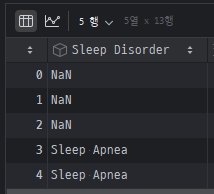
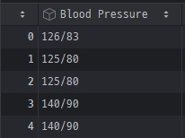
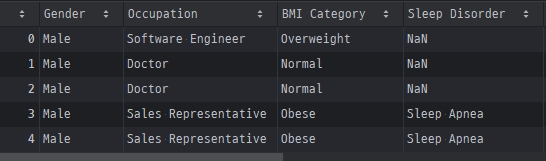
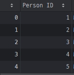
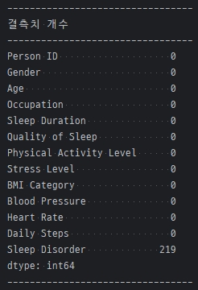
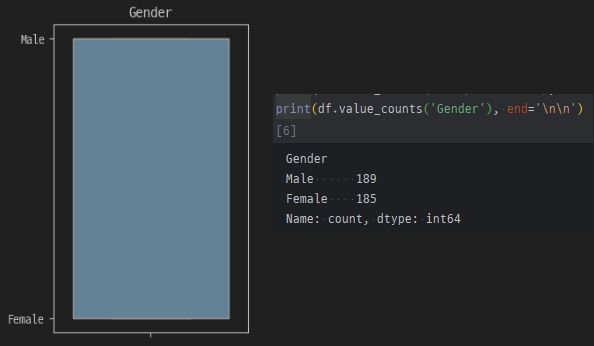
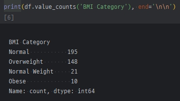
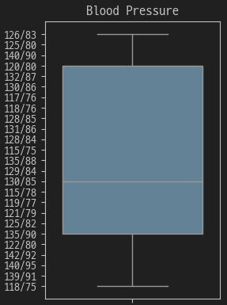
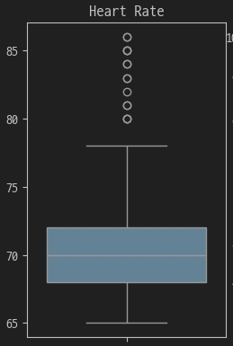

## 02. 데이터 구조 및 변수 이해
| image                                   | description                                                                                                |
|:----------------------------------------|:-----------------------------------------------------------------------------------------------------------|
|| 데이터는 *`13개`* 의 특성을 가진 *`374개`* 의 레코드로 이루어져있다.                              |
|   | `Sleep Disorder` 의 결측치는 _질병이 없다_ 는 의미이므로 결측치 처리 시 _`"None"`_ 으로 처리하는게 좋겠다. |
|    | `Blood Pressure` 는 최고/최저 수치가 모여있으므로 `BP high` 와 `BP low` 로 분리해야겠다.                   |
|       | 그 밖에 범주형 데이터들은 수치형으로 변환한다.                                                             |
|         | 전처리가 완료되면, 복사본 DF 를 만들고 `Person ID` 항목을 제거하고 보는게 좋겠다.                          |


## 03. 데이터 요약 및 기술통계
```python
# 수치형 데이터를 위한 describe() 결과
display(df.describe())

# 범주형 데이티를 위한 value_counts() 결과
print(df.value_counts('Gender')         , end='\n----------------------------------\n')
print(df.value_counts('Occupation')     , end='\n----------------------------------\n')
print(df.value_counts('BMI Category')   , end='\n----------------------------------\n')
print(df.value_counts('Blood Pressure') , end='\n----------------------------------\n')
print(df.value_counts('Sleep Disorder') , end='\n----------------------------------\n')
```

## 04. 결측치, 이상치 탐지(혈압, 수면장애 - 무호흡증, 불면증)
각 컬럼에서 결측치와 이상치, 데이터 형태 등을 확인해봐야겠다.
1. 결측치는 isna().sum() 으로 보면 쉽게 파악할수 있을것 같다.
2. 이상치는 boxplot 을 그려보면 쉽게 파악할 수 있을것 같다.
```python
print("컬럼별 정상치 개수" , end="\n---------------------------------\n")
print(df.info()            , end="\n---------------------------------\n")
print("결측치 개수"        , end="\n---------------------------------\n")
print(df.isna().sum()      , end="\n---------------------------------\n")
```
```python
fig, ax = plt.subplots(2,6)
fig.set_figwidth(20)
fig.set_figheight(10)

for i,col in enumerate(df.iloc[:, 1:12].columns):
	_ax = ax[i//6, i%6]
	sns.boxplot(df, y=col, ax=_ax)
	_ax.set(ylabel="", title=col)

plt.show()
```

| image                                      | description                                                                                                                          |
|--------------------------------------------|--------------------------------------------------------------------------------------------------------------------------------------|
|            | `Sleep Disorder` 외엔 결측치에 대해서는 걱정할 필요가 없어보인다.                                                                                         |
|  | `Gender` 는 그래프 모양은 좀 이상해도, Mail/Female 로 잘 나뉘어있으므로 라벨링만 추가로 조치해야겠다.                                                                  |
|      | `BMI Category` 는 범주형 데이터이므로 이상치보다는 분포를 확인하는 것이 더 좋겠다.<br/>`BMI Category`에서 _`"Normal"`_ 과 _`"Normal Weight"`_ 의 차이를 구별할 만한 기준이 부족하다. |
|                                | `Blood Pressuer` 는 계획대로 분리한 다음 다시 확인이 필요하다.                                                                                          |
|                                | `Heart Rate` 는 이상치가 있는걸까? 다른 시각화 툴을 이용해 추가 확인이 필요하다.                                                                                 |

- `Heart Rate` 는 60~100 범주라면 정상범위로 볼 수 있다.
    - 히스토그램을 통해 확인해보면 이상치가 아니라 `대부분의 데이터가 IQR 범위`에 몰려있어서 나타난 현상으로 보인다.
- 그 외 데이터들은 탐지한 결측치/이상치에 대하여 전처리를 진행한다.
  1. `Person ID` 는 drop
  2. `Sleep Disorder` 의 결측치는 _`"None"`_ 으로 처리
  3. `Blood Pressure` 의 분리
  4. 연속형 특성들을 범주화.
  5. 범주화 특성들의 라벨링

```python
# Person ID 는 drop
df.drop(columns=["Person ID"], inplace=True)

# Sleep Disorder 의 결측치는 "None" 으로 처리
df["Sleep Disorder"] = df["Sleep Disorder"].fillna("None")

# Blood Pressure 의 분리
def bp_high(bp):	return bp.split("/")[0]
def bp_low(bp): 	return bp.split("/")[1]
df["BP high"] = df["Blood Pressure"].apply(bp_high).astype(int)
df["BP low"]  = df["Blood Pressure"].apply(bp_low).astype(int)

# 연속형 특성들의 범주화
# `Age`, `BP high`, `BP low`, `Heart Rate`, `Daily Steps`, `Sleep Duration`, `Physical Activity Level`
grouping = lambda x : x // 10
df["Age Group"]             = df["Age"]                     .apply(grouping)
df["BP high Group"]         = df["BP high"]                 .apply(grouping)
df["BP low Group"]          = df["BP low"]                  .apply(grouping)
df["Heart Rate Group"]      = df["Heart Rate"]              .apply(grouping)
df["Daily Steps Group"]     = df["Daily Steps"]             .apply(lambda x : x // 1000)
df["PhAL Group"]            = df["Physical Activity Level"] .apply(grouping)
df["Sleep Duration Group"]  = (df["Sleep Duration"] + 0.5).truncate(0).astype(int)

# 라벨링되지 못한 잔여 범주화 특성들의 라벨링
# `Gender`, `Occupation`, `BMI Category`, `Sleep Disorder`
from sklearn.preprocessing import LabelEncoder
gender_encoder      = LabelEncoder()
occupation_encoder  = LabelEncoder()
bmi_encoder         = LabelEncoder()
disorder_encoder    = LabelEncoder()

df["Gender Label"]      = gender_encoder    .fit_transform(df["Gender"])
df["Occupation Label"]  = occupation_encoder.fit_transform(df["Occupation"])
df["BMI Label"]         = bmi_encoder       .fit_transform(df["BMI Category"])
df["Sleep Label"]       = disorder_encoder  .fit_transform(df["Sleep Disorder"])

print("gender Label : "     , gender_encoder.classes_)
print("Occupation Label : " , occupation_encoder.classes_)
print("BMI Label : "        , bmi_encoder.classes_)
print("Sleep Label : "      , disorder_encoder.classes_)
```
위와 같이 전처리하고난 후 데이터와 라벨 상태를 countplot 으로 확인해보면 각 특성이 수치값으로 잘 범주화되어있는 모습을 확인할 수 있다.
```python
columns = ["Quality of Sleep", "Stress Level", "Age Group", "BP high Group", "BP low Group", "Heart Rate Group", "Daily Steps Group", "PhAL Group", "Sleep Duration Group", "Gender Label", "Occupation Label", "BMI Label", "Sleep Label"]

fig, ax = plt.subplots(len(columns)//4 + 1,4)
fig.set_figwidth(20)
fig.set_figheight(10)

for i,col in enumerate(columns):
	_ax = ax[i//4, i%4]
	sns.countplot(df, x=col, ax=_ax)
	_ax.set(ylabel="", title=col)
plt.show()
```